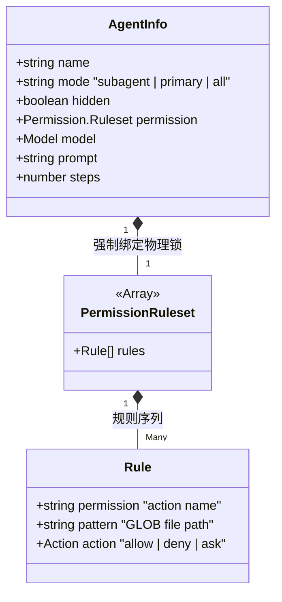

# 1.1 探员图谱：万物起于 `Agent.Info`

## 📖 核心认知：OpenCode 里的智能体到底是什么？

在传统的 LLM 聊天平台中，“智能体”往往只是一个在每次对话前生硬地拼接上去的 System Prompt。
但在 **OpenCode** 架构下，智能体（Agent）是一个由极其严格的 TypeScript Schema 包裹的**独立容器**。它不仅带有灵魂（Prompt），还被赋予了极高维度的**物理锁（Permission Ruleset）**、**工具隔离沙箱**、甚至自己的**隐藏模式（Hidden Agent）**标志。

所有的起点，都在 `packages/opencode/src/agent/agent.ts`。

---

## 🗺 架构：智能体的静态 DNA 拓扑



### 🧬 原生探员一览：七种系统自带的基因

在 `agent.ts` 源码中，系统硬编码了 7 种系统自带的基座原生探员，这些并非随意发挥的 Prompt，而是各司其职的齿轮：

*   **1. `build` (Primary)**：默认的全能型智能体，拥有几乎全栈的操作权限。
*   **2. `plan` (Primary)**：架构师。**底层被物理剥离了 `edit`（除了改 `.md`）的写代码权限**，逼迫模型只能读代码和思考，极大地抑制了模型的“幻觉”。
*   **3. `general` (Subagent)**：可以被别的探员利用 `task` 工具拉起的廉价子系统，常用来并发回答多线程问题。
*   **4. `explore` (Subagent)**：超快速检索员。底层权限 `"*": "deny"`，只被 `allow` 了 `grep`, `glob`, `list`, `read` 等只读操作。
*   **5. `compaction` (Hidden)**：幽灵降维探员。不会出现在你的列表里（因为 `hidden: true`），只会在主屏幕要炸掉的时候被偷偷唤醒。
*   **6. `title` (Hidden), 7. `summary` (Hidden)**：两个专门只做文字处理的廉价隐身工具人。

---

## 🔍 代码溯源：权限锁是如何跟在骨架上的？

在很多 Agent 系统里，如果你不让它碰某个文件，你通常会在 Prompt 里喊：“不要修改 `node_modules`！”。而大模型发神经的时候，往往直接把这话当耳旁风。
但在 OpenCode 里，我们看看 `agent.ts` 中声明 `explore` (搜索专用探员) 的源码：

> **`packages/opencode/src/agent/agent.ts`**
>
> ```typescript
> explore: {
>   name: "explore",
>   permission: Permission.merge(
>     defaults,
>     Permission.fromConfig({
>       "*": "deny",            // 【物理阻断】禁止它使用除下方列表外的任何能力！
>       grep: "allow",
>       glob: "allow",
>       list: "allow",
>       bash: "allow",
>       webfetch: "allow",      // 【放行外网】
>       websearch: "allow",
>       codesearch: "allow",
>       read: "allow",
>       external_directory: {
>         "*": "ask",
>         ...Object.fromEntries(whitelistedDirs.map((dir) => [dir, "allow"])),
>       },
>     }),
>     user, // 将用户的 .opencode 配置接在末尾，允许覆盖优先级。
>   ),
>   description: `Fast agent specialized for exploring codebases...`,
>   prompt: PROMPT_EXPLORE,
>   mode: "subagent",
>   native: true,
> }
> ```

这也就是为什么 OpenCode 的底盘如此之稳：**智能体的认知能力（LLM 推理）和执行能力（OS 权限）在结构定义时便一分为二！**

---

## 🛠 实战落地：绕过命令，从高维 JSON 生成一个私人保镖 Agent

现在你完全理解了底层这层骨干，如果要自定义专属探员，怎么做？
你只需要遵循上述的 `AgentInfo` JSON Schema 并在你自己的被调用配置文件里复刻就行了。

例如：我如果需要一个极端安全的“配置核对员 Agent”，我不希望它有任何可能改变我现有工作空间的权限。

你只需在 `.opencode/config.json` 里这样定义：

```json
{
  "agent": {
    "config-auditor": {
      "mode": "subagent",
      "description": "专用于核实 YAML 的审核员，不具备任何修改执行权",
      "prompt": "You are a highly skilled YAML and JSON config auditor...",
      "permission": {
        "*": "deny",             
        "read": "allow",         
        "grep": "allow",
        "bash": "ask",           
        "external_directory": {  
          "/tmp/*": "allow",
          "*": "deny"
        }
      }
    }
  }
}
```

这就是从 **纯纯的文字堆叠（Prompt engineering）** 升纲成了 **系统级约束工程 (Harness Engineering)** 跨出的破冰第一步。
