# 1.3 阻断执行网：绝非儿戏的 Glob 权限防御层 (Permission Engine)

## 📖 核心认知：不要妄图通过语言说服野兽

我们在 `1.1` 中看到了探员身上背着的 `Permission Ruleset`（比如 `"read": "allow"`，`"*": "deny"`）。但在运行时，难道系统在工具调用时，再去给大模型发一条指令让它检查？
绝不是。**这是 OpenCode 防呆设计的核心机密——绝不相信模型，防线建立在代码层！**

在 `packages/opencode/src/permission/index.ts` 中，OpenCode 用极其优雅的 `Effect-TS` 控制反转机制，将底层的 OS 行为与人类的“审批（Ask）”硬生生用时序挂起（Suspension）的方式钉死在了一起。

---

## 🗺 架构：权限防线的物理串联图

```mermaid
sequenceDiagram
    participant LLM as 模型试图使用工具
    participant Hook as processor.ts
    participant Perm as permission/index.ts
    participant UI as 人类 (终端或网页)
    participant Exec as 真实执行器

    Note over LLM, Exec: 场景：模型试图通过 bash 执行 "rm -rf .env"
    
    LLM->>Hook: JSON { command: "rm -rf .env" }
    
    rect rgb(50, 20, 30)
        Note over Hook, Perm: --- 阶段 A：沙箱查房 (AST / Glob 过滤) ---
    end
    Hook->>Perm: ask({ permission: "bash", pattern: "*.env" })
    Perm->>Perm: 在 Ruleset 里查表。匹配：`"*.env": "ask"`
    
    rect rgb(30, 40, 50)
        Note over Perm, UI: --- 阶段 B：死锁挂起 (Deferred Suspension) ---
    end
    Note over Perm: 致命挂起：EventLoop 停止在该进程！<br/>yield* Deferred.make<void, Error>()
    Perm->>UI: Bus.publish(Event.Asked, ...) 
    
    UI->>UI: 控制台显示：模型想删除 .env，同意吗 [y/N/A]？
    alt 人员按 N (拒绝)
        UI-->>Perm: reply "reject"
        Perm->>Hook: 抛出 PermissionRejectedError 异常
        Hook-->>LLM: 断言错误逼迫 LLM 重做！
    else 人员按 Y (单次放行)或 A (永远放行)
        UI-->>Perm: reply "once" / "always"
        Perm->>Exec: Deferred.succeed() 恢复流转！跳转执行
    end
```



---

## 🔍 代码溯源：挂机阻断的真相就在 `Deferred`

如果你去追踪系统如何拦截，最后你会走到这段核心代码。它解释了对于匹配到 `ask` 动作的高危指令，是如何在极短时间内拉起屏幕端交互的：

> **`packages/opencode/src/permission/index.ts`**
>
> ```typescript
> const ask = Effect.fn("Permission.ask")(function* (input: z.infer<typeof AskInput>) {
>   const { ruleset, ...request } = input
>   let needsAsk = false
> 
>   // 1. AST 解析出的受影响路径，挨个拉出来匹配 Glob
>   for (const pattern of request.patterns) {
>     const rule = evaluate(request.permission, pattern, ruleset, approved)
>     
>     // 若直接为 deny，立刻抛错，主循环中接住这个错误报给大模型
>     if (rule.action === "deny") {
>       return yield* new DeniedError({ ruleset })
>     }
>     // 若有任意一个是 ask，转入人工挂机模式
>     if (rule.action === "allow") continue
>     needsAsk = true
>   }
>   if (!needsAsk) return
> 
>   // 2. 悬停机制核心：由于是在生成器 yield* 里，此时代码【死锁停止执行】
>   const deferred = yield* Deferred.make<void, RejectedError | CorrectedError>()
>   pending.set(id, { info, deferred }) // 把任务存入待办 Map
>   
>   // 3. 将求救信号打出 Event Bus 交给前端终端/网页
>   void Bus.publish(Event.Asked, info)
>   
>   // 4. 等待用户答复后通过 Deferred 破冰，否则死不放行
>   return yield* Effect.ensuring(
>     Deferred.await(deferred),
>     Effect.sync(() => { pending.delete(id) })
>   )
> })
> ```

通过 `Effect.Deferred`，引擎在不需要阻塞 Node.js 主事件循环的前提下，“静默”了当前 Agent 的这条时间轴。

---

## 🛠 实战落地：在公司建立属于你们的红线区

读懂这段源码的伟大之处在于：**有了 Glob 的 `deny/ask` 与 `Deferred` 断点系统，你能不加任何底层插件逻辑，就能硬气地挡住大模型的屠刀**。

假设你们公司的后台服务核心密码全存在 `settings/passwords.yml`，你担心模型不仅误读、甚至在测试时用 `write` 工具或 `sed` 命令不小心将其抹除。在 `_digested` 理解它之后，你明白此时最好的办法根本不是加很长的 System Prompt 去警告他。

而是在你们该域的 `Agent.Info` 或者全局 `.opencode/config.json` 里暴力挂上 Glob 路径锁：

```json
{
  "permission": {
     "edit": {
       "settings/passwords.yml": "deny"
     },
     "read": {
       "settings/passwords.yml": "ask"
     }
  }
}
```

如此这般，当模型发出含有此路径的操作时，`Permission.ask` 在第一层就将它斩于刀下或者进入终端 `Bus.publish` 提示人类审核。这就是 OpenCode 硬核安全边界的代码真相。
