# 1.3 兵器池投喂：插件如何化身 LLM 工具 (Tools Registry)

## 📖 核心认知：外设能力的“包裹协议”

大模型能够通过返回特定的 JSON (例如 `{"name": "bash", "arguments": { ... } }`) 来调用工具。但问题是：你散落在磁盘里的 `.ts` 脚本、全局配置、或者远端 MCP 提供的外星能力，系统是怎么在第一步转化为大模型能看懂的“兵器池（Tools）”的？

这一步发生在 `01-Anatomy` 静态体系的最后一块拼图：`Registry`。
这层抽象将业务代码剥离，无论它是一个多暴力的 Shell 命令，还是一套极高阶的 Subagent 分派器。在 `packages/opencode/src/tool/registry.ts` 和 `packages/opencode/src/session/prompt.ts` 里，它们都会被塞进一层**厚厚的强类型减震沙箱**。

---

## 🗺 架构：Vercel AI SDK 与 OpenCode 的握手协议

```mermaid
sequenceDiagram
    participant Config as .opencode/tools/*.ts
    participant MCP as MCP 协议外挂
    participant Registry as registry.ts
    participant SDK as ai (Vercel Core)
    participant LLM as OpenAI / Claude

    rect rgb(30, 40, 50)
        Note over Config, Registry: --- 第一阶段：物理载入与解析 (Static) ---
    end
    Config->>Registry: Tool.layer 动态扫描 fs 载入插件
    MCP->>Registry: MCP.Service 解析远端 Capability
    
    rect rgb(50, 40, 30)
        Note over Registry, SDK: --- 第二阶段：模型兼容层 (Provider Transform) ---
    end
    Registry->>Registry: 工具过滤 (根据 Agent.Info 的 Permission 过滤不被允许的项)
    Registry->>SDK: ProviderTransform.schema(...) <br> 将 Zod 参数转换为特定模型的 JSON Schema
    
    rect rgb(30, 50, 40)
        Note over SDK, LLM: --- 第三阶段：执行上下文的注入 (Context Wrapping) ---
    end
    Note over SDK, LLM: 注入 ctx: { abort(), ask(), updatePart() }<br/>将裸辞函数升级为具有总线通信能力的 Agent Tool
    
    SDK->>LLM: fetch(..., tools: [...])
    LLM-->>SDK: ToolCall: {"name": "your_custom_cli"}
```



---

## 🔍 代码溯源：减震沙箱是如何包裹工具的

如果我们看 `prompt.ts` 里将注册表（Registry）的工具转化为给模型喂入的标准 `ai` 库格式的逻辑：

> **`packages/opencode/src/session/prompt.ts - resolveTools`**
>
> ```typescript
> const resolveTools = Effect.fn("SessionPrompt.resolveTools")(function* (input) {
>   const tools: Record<string, AITool> = {}
> 
>   // 1. 生成极权上下文，工具里的代码其实是在上下文中跑的
>   const context = (args: any, options: ToolExecutionOptions): Tool.Context => ({
>     sessionID: input.session.id,
>     abort: options.abortSignal!,
>     messageID: input.processor.message.id,
>     callID: options.toolCallId,
>     ask: (req) => Effect.runPromise(permission.ask(...)) // 将提权操作丢出来！
>   })
> 
>   // 2. 从注册表中拿出现有模型和探员允许持有的工具列表
>   for (const item of yield* registry.tools(..., input.agent)) {
>     
>     // 3. 将原先我们在写工具时使用的 Zod 强类型，降维转成大模型能懂的 JSON Schema
>     const schema = ProviderTransform.schema(input.model, z.toJSONSchema(item.parameters))
>     
>     // 4. 调用 Vercel AI 的工具生成工厂
>     tools[item.id] = tool({
>       id: item.id as any,
>       description: item.description,
>       inputSchema: jsonSchema(schema as any),
>       execute(args, options) {
>         return Effect.runPromise(Effect.gen(function* () {
>           const ctx = context(args, options)
>           
>           // 触发 EventBus 前置拦截器（让插件此时可以介入）
>           yield* plugin.trigger("tool.execute.before", ...)
>           
>           // 执行！
>           const result = yield* Effect.promise(() => item.execute(args, ctx))
>           
>           return {
>             ...result,
>             attachments: result.attachments?.map((attachment) => ({
>                // 如果工具生成了图表、文件流，此时被转化为挂载在 Message 树上的附件
>             }))
>           }
>         }))
>       }
>     })
>   }
>   return tools
> })
> ```

通过上面这段复杂的“脱壳 -> 挂钩 -> 重新包裹”操作，任何散写在外部的无状态函数，就硬生生被 OpenCode 变成了一个。**只要报错就能抛给 SDK 拦截，只要执行了高危指令就能通过 `ask()` 把主线卡死等待人工审核**的原生超高级兵器。

---

## 🛠 实战落地：为什么 OpenCode 支持跨服模型热插拔？

很多自己手写的野生 Agent 框架（比如只写 OpenAI）往往最后死在换模型上，因为 Claude 的 Schema 限制、Gemini 的 Type 不一。

正因为 OpenCode 把这一步做在了 `ProviderTransform.schema(...)` 和 `ai` 官方库的 `tool()` 里，这让你的 Custom CLI 注入或者内部逻辑有了**跨宇宙互通性**。如果你想在你们项目的 `.opencode/tools` 里写一个访问公司内网 Jira 接口的拉取器，**你不必要为了 OpenAI 写一套 Json 格式，又去给 DeepSeek 写一套**。

在架构层面，这不仅是一种能力注入，更是一种**绝地隔离**。大模型永远无法直接接触到这台电脑的裸操作系统，它们摸到的永远是：
>`tool()` 包裹着 `ProviderTransform` 包裹着 `Plugin.trigger` 包裹着 `Permission.ask` 包裹着真实的执行逻辑。
