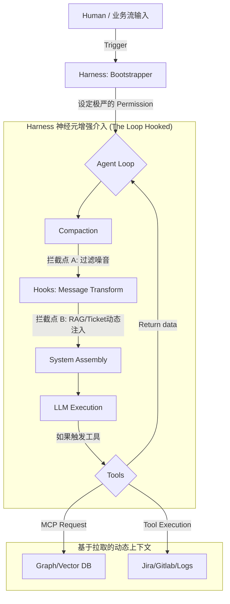

# Agent Loop 核心解构与上下文增强 (Harness 设计指南)

本篇文档旨在深入解构 OpenCode 的 `Agent Loop`（其真正的运转心脏），并探讨：**当我们理解了这个 Loop 以后，该如何通过注入多维度的上下文，系统性地构建一层“驾驭框架 (Harness)”，从而突破基础模型的能力天花板。**

---

## 一、重新认识 Agent Loop 的“心跳”

在 OpenCode 的底层实现 (`packages/opencode/src/session/prompt.ts` 中的 `runLoop`，即你所指的“靠/Core”) 中，Agent 并非传统的“一问一答”触发器，而是由状态机维持的**自治循环 (Autonomous Loop)**。

一次标准的 Loop 搏动，遵循如下严格的时序流转：

1. **状态对齐 (State Alignment)**: 从底层的持久化层 (sqlite) 流式读取当前 Session 的 `msgs` (历史消息图谱)。
2. **截断洗环 (Compaction / Pruning)**: 检查 Token 大小，识别 `msg.info.summary`，如果超出阈值则强行清洗和压缩上下文，防止“失忆”和“发疯”。
3. **上下文动态拼装 (System Assembly)**: 这是最核心的一环。所有的“额外知识”都在这里交汇。系统通过 Effect 并发获取：
   - 基础环境变量 (`SystemPrompt.environment`)
   - 目录与 LSP 类型感知 (`LSP Document Symbols`)
   - 用户的规则文件 (`SystemPrompt.skills`)
   - 并且**触发关键的 Plugin Hooks**（例如 `experimental.chat.messages.transform`），允许外部拦截和篡改发往大模型的 Payload。
4. **沙箱执行判断 (Tool Resolution & Processor)**: 根据当前的 Permission 矩阵动态屏蔽或放行 工具的执行。如果遇到 `doom_loop: "ask"` 的死循环风险，进行拦截。
5. **模型交互与决策反馈**: 调集上文所有数据打向底层 LLM，根据返回的 `tool-calls` 重启循环，或是收到结束标志 `finish: "stop"` 终止当前任务。

---

## 二、如何为 Agent Loop 注入上下文强化能力 (Context Augmentation)

理解了 Loop 的时序，Harness 的设计重点就不再是“写一句更复杂的 Prompt 本文”，而是**在上述的 5 个生命周期节点中，实施结构化的 Context 注入**。以下是构建高级增强框架的构思方案：

### 1. 静态声明式的推模式注入 (Push-based via Skills)
**切入点**: `SystemPrompt.skills` 节点
**构思**: OpenCode 原生支持读取特定的规则文件。在构建 Harness 时，你可以建立一套极度动态的“路由规则系统”。
- **增强做法**: 不要全局堆砌开发规范，而是编写一个外部服务，根据 Agent 当前聚焦的工作区甚至文件后缀，**动态置换/挂载（Mount）专门的 Skill Markdown 文件**。
- **效果**: 当系统处理 React 组件时，Agent 的 System Prompt 里会被动态打入 `react_guidelines.md`；而在写 Python 后端时，会被打入 `python_architecture_rules.md`。

### 2. 动态钩子的高级拦截过滤 (Interceptor-based via Hooks)
**切入点**: `Plugin.trigger("experimental.chat.messages.transform")`
**构思**: 当对话历史 `msgs` 变得极长时会严重干扰 Agent 对当前焦点的理解。Harness 能够利用这个原生钩子，做一次在发送给 LLM 前的“洗报文”操作。
- **增强做法**: 编写 Plugin，介入该生命周期。将 `msgs` 中非必要的 `tool` 执行明细折叠，同时基于高维向量检索 (RAG)，将外部的业务上下文（如相关的 Jira Ticket，Slack讨论或接口协议变更文档）通过一个隐式 Message 硬塞入历史流中。
- **效果**: LLM 会以为这些外部系统的业务知识，也是自己工作流记忆的一部分，从而在无缝衔接下做出正确推断。

### 3. 基于外接大脑的拉模式注入 (Pull-based via MCP)
**切入点**: `mcp.readResource` 结合工具响应阶段
**构思**: 在庞大的微服务系统中，你不可能把几十个微服务架构图全推给 LLM。利用 Model Context Protocol (MCP) 让 Agent "自己去查"。
- **增强做法**: 为 OpenCode 开发专门的 MCP 服务器集群。比如 `Observability MCP`（连接日志系统或监控）。
- **流程**: Harness 不需要一开始就推送日志给大模型。相反，在 System Assembly 中通过 MCP 暴露可用资源目录。Agent Loop 执行时如果遇到了未知报错，它会主动通过 `readResource` 或 `Tools` 挂载对应的 MCP 读取实时错误堆栈。
- **效果**: 让上下文的获取成为一个 Lazy Evaluation (懒加载)，这极大地扩张了它的处理边界。

### 4. 空间与降维控制 (Spawning Subtasks)
**切入点**: Loop 前期的 `task?.type === "subtask"`
**构思**: 复杂的上下文会让单一的 Agent Loop 陷入逻辑断层甚至宕机。
- **增强做法**: 打造一种“多脑分离”的 Harness。主理人 Agent (比如内置的 `plan` 或者 `general`) 只负责解析高阶宏观的输入，然后利用工具动态生成独立的、短小精辟的 System Prompt，孵化 (`spawn`) 一个高度特化、权限受限的 Subagent。
- **效果**: 主力大循环被切分为数个平行的小循环。每个大循环处理大文本的上下文，而真正的写代码的 Sub-loop 只处理这一个文件的极简上下文。

---

## 三、框架设计的全盘构思 (Architectural Conceptualization)

如果你要在业务层面上把这套 AI Coding 把控起来，合理的结构应该是采用一种**外接包壳 (Exoskeleton/Shell)** 加上 **内建神经元 (Plugins/Tools)** 相结合的 Harness 设计模式：

**我们达成的共识**：
强化 Agent 能力的核心，不是像教人一样在一次对话里说上万字。而是**构建一个精准、冷酷的拦截机与拼装机。** 在它循环启动引擎的那一瞬间（组装 System Prompt 与 Message 时），将最能帮助它存活与输出的代码、指令、权限，不讲道理地注入到它的上下文中。

这就是 OpenCode 最具商业与工程价值的可塑性精髓所在。
