# 2.2 脑电波拦截：极其骇客的 Processor 流流控

## 📖 核心认知：如何截断狂暴大模型的吐字流？

如果我们说 `2.1` 中那个宏大的 `while(true)` 是智能体一圈一圈跑的赛道，那么在 `packages/opencode/src/session/processor.ts` 区间内的代码，则是铺设在赛场里的每一根地刺、拦截网和探测器。

流式响应（Stream）就像是一头每秒钟喷洒数百个字符和代码片段的猛兽。系统不仅要让用户看见它在一个字一个字地吐文本，同时一旦它突然混入了“思考思维链” (`reasoning-start`) 或者“工具触发码” (`tool-input-start`)，系统必须**光速介入**做拦截分类！

---

## 🗺 架构：微秒级的事件风暴

在 `Processor.ts` 内，对于 LLM 返回回来的 Stream Event 的核心时序就像这样分家：

```mermaid
sequenceDiagram
    participant LLM as Vercel AI SDK
    participant EventLoop as processor.ts: handleEvent()
    participant Memory as MessageV2 树形分叉存储
    participant Status as 客户端 UI
    
    LLM-->>EventLoop: yield "text-delta" ("你")
    EventLoop-->>Memory: 寻找当前分叉 text 挂载
    Memory-->>Status: 即时输出 "你"
    
    LLM-->>EventLoop: yield "reasoning-start"
    Note over EventLoop, Memory: 模型进入深度沉思阶段 (DeepSeek-R1 / O1 模式)
    EventLoop-->>Memory: 单独分叉出一个 reasoningMap
    EventLoop-->>Status: 界面开始展示思维折叠框
    
    LLM-->>EventLoop: yield "tool-call: bash"
    rect rgb(50, 20, 30)
        Note over EventLoop: 暴走抑制检测 (The DOOM LOOP Check)
    end
    EventLoop->>EventLoop: 向上回溯过去历史：最近3次，这模型是不是在连续执行这个错代码！
    EventLoop-->>Status: 如果发疯，唤起 permission.ask() 扔给人类看
    
    LLM-->>EventLoop: yield "finish-step"
    Note over EventLoop: 拦截器统计消费 Token (cost)，校验 Overflow 上限。
```



---

## 🔍 代码溯源：著名的“三振出局防御 (Doom Loop)”

大模型最蠢的时刻是什么？是它写了一句有语法错误的 Bash 脚本，控制台报了 `Syntax Error`，然后它“试图”修复，却又发出了和上一秒一模一样的破代码命令！然后死循环把你们公司号的几百刀 Token 刷光......

为了不重蹈覆辙，在 `processor.ts` 源码中藏着一道举世瞩目的物理开关，这就是拦截器的核心意义：

> **`packages/opencode/src/session/processor.ts - 暴走死循环阻拦器`**
>
> ```typescript
> const DOOM_LOOP_THRESHOLD = 3;  // 【物理写死三次上限】
> 
> case "tool-call": {
>   // 1. 获取过去整棵消息树
>   const parts = yield* Effect.promise(() => MessageV2.parts(ctx.assistantMessage.id))
>   // 2. 只拿最后发生过的有限次
>   const recentParts = parts.slice(-DOOM_LOOP_THRESHOLD)
> 
>   // 3. 精准锁定发神经匹配
>   // --如果刚好满了 3 次 并且
>   // --全都是针对当前同一个工具触发 并且
>   // --所有发给工具执行的参数 Input 竟然一个字都不差的全相等！！
>   if (
>     recentParts.length !== DOOM_LOOP_THRESHOLD ||
>     !recentParts.every(
>       (part) =>
>         part.type === "tool" &&
>         part.tool === value.toolName &&
>         part.state.status !== "pending" &&
>         JSON.stringify(part.state.input) === JSON.stringify(value.input),
>     )
>   ) {
>     return // 没事，它还在正常的试错路上，放过它。
>   }
> 
>   // 4. 重磅制裁！向权限引擎下达极高权限死锁指令
>   const agent = yield* agents.get(ctx.assistantMessage.agent)
>   yield* permission.ask({
>     permission: "doom_loop",
>     patterns: [value.toolName],
>     sessionID: ctx.assistantMessage.sessionID,
>     metadata: { tool: value.toolName, input: value.input },
>     always: [value.toolName],
>     ruleset: agent.permission, // 直接跳进人工问询！阻止大模型烧钱！
>   })
>   return
> }
> ```

---

## 🛠 实战落地：让架构不再畏惧模型的愚蠢

如果你是个试图定制甚至重写这套 Agent 体系的人，这段代码告诉你一个最血淋淋的教训：**不要在 System Prompt 中花力气写“你千万不要多次执行同样的错误代码”。这在深层推理逻辑中几乎没任何强制力。**

像 OpenCode 的 `processor.ts` 一样，在最底层的 I/O 汇聚点进行 **物理级字符串碰撞** 来识别模型幻觉。

再举一个最强有力的拦截器例子——在碰到溢出时候发出的 `needsCompaction` 信号（代码里的 `case "finish-step"`）。
如果一瞬间一个读取文件或读取终端结果过大撑爆：
```typescript
if (!ctx.assistantMessage.summary && isOverflow(...)) {
  ctx.needsCompaction = true
}
```
**`processor.ts` 是智能体感知到“自己快要脑溢血”的疼痛中枢神经**。它向 `prompt.ts` 主循环抛出 `compact` 警告，为接下来的幽灵压缩探员登场拉开帷幕。
