# 3.1 降维幽灵探员：对抗不可逆转的上下文熵增 (Compaction)

## 📖 核心认知：记忆是如何爆炸并毁掉模型的？

在一个持续运行十几轮对话、动辄读取数千行代码文件并执行过十几次命令行编译的复杂任务中。哪怕你使用的是拥有 128k Token 视野甚至 200k Token 的长窗口模型（如 Claude 3.5 Sonnet 或 OpenAI o1），**它也大概率会变成一个弱智。**

这叫做**中段失焦（Lost in the middle）**或者**上下文熵增**。
当历史记录填满了各种诸如 `npm WARN ...`、`Cannot find module ...` 等高注意力消耗的垃圾时，模型再也想不起第一轮你们的初衷是什么了。

为了让 OpenCode 成为一个**长线、不死亡**的企业级智能体，架构师在 `packages/opencode/src/session/compaction.ts` 里设计了一套足以写入大模型开发教科书的杀手锏系统——**幽灵压缩探员（The Hidden Compaction Agent）**。

---

## 🗺 架构：无感知的降维提纯

```mermaid
sequenceDiagram
    participant MainLoop as 主循环 (使用者与主模型)
    participant Processor as 拦截器 (processor.ts)
    participant Compactor as 幽灵探员 (compaction.ts)
    participant Memory as 当前对局数据库
    participant LLM as API (后台并发消耗)
    
    rect rgb(30, 40, 50)
        Note over MainLoop, Processor: 灾难来临前夜
    end
    MainLoop->>Processor: {role: "assistant", finish: "step..."}
    Processor->>Processor: Tokenizer 拦截器计算出已经累积逼近阈值
    Processor-->>MainLoop: 抛出断点 ContextOverflowError 警告
    MainLoop->>Compactor: process({ parentID: ..., auto: true })

    rect rgb(50, 40, 30)
        Note over Compactor, LLM: 黑盒手术 (完全静默、不阻塞人类)
    end
    Note over Compactor: 1. 设置 agent: "compaction", hidden: true<br/>2. 拔除过去繁冗上下文里的图片/附件

    Compactor->>Compactor: 注入史诗级提纯 Prompt: <br/>"## Goal..."、"## Instructions..."<br/>"## Discoveries..."、"## Accomplished..."
    Compactor->>LLM: 抛开工具，纯纯的归纳总结网络流请求！
    LLM-->>Compactor: 吐回一份极其干练的三段论文字摘要

    rect rgb(30, 50, 40)
        Note over Compactor, Memory: 替换宿主大脑
    end
    Compactor->>Memory: 将这三段摘要标记为 `synthetic: true` 假扮成人类指令
    Memory-->>MainLoop: 删除过去几万字，用 300 Token 的“战报”填回主轨道继续！
```



---

## 🔍 代码溯源：揭秘幽灵探员的工作本质

为什么我们在使用 OpenCode 时，明明聊了很久并且丢进去无数大代码，但它依然能接茬干活儿且不会报 `Context Exceeded`？
秘诀在于 `processCompaction` 完全劫持了这个回溯机制：

> **`packages/opencode/src/session/compaction.ts - 幽灵代理出更`**
>
> ```typescript
> // 1. 创建一只绝对看不见的专门干脏活的模型探员实例
> const msg: MessageV2.Assistant = {
>   role: "assistant",
>   mode: "compaction",
>   agent: "compaction", // 这只探员在 config.json 里被加上了 "hidden": true !
>   summary: true,       // 将产出属性打上重型 Tag
>   ...
> }
> 
> // 2. 系统强制给他套上一个名为 defaultPrompt 的死模版，锁死它的灵魂
> const defaultPrompt = `Provide a detailed prompt for continuing our conversation above.
> Focus on information that would be helpful for continuing the conversation...
> 
> When constructing the summary, try to stick to this template:
> ---
> ## Goal
> [What goal(s) is the user trying to accomplish?]
> 
> ## Instructions ...
> ## Discoveries ...
> ## Accomplished ...
> ## Relevant files / directories ...
> ---`
> 
> // 3. 将前面让主模型近乎脑溢血的所有几十万字对话，全部塞给这只轻量模型。并带上模板
> const result = yield* processor.process({
>   messages: [
>     ...modelMessages, 
>     { role: "user", content: [{ type: "text", text: prompt }] }
>   ],
> })
> 
> // 4. 【换脑完毕】把产出的精简文字当作人类的一句 "Continue" 命令插回去，继续接力赛
> const continueMsg = yield* session.updateMessage({ ... })
> yield* session.updatePart({
>   type: "text",
>   synthetic: true, // 伪造标记
>   text: "The previous request exceeded... Continue if you have next steps...",
> })
> ```

这就是真正的“机器写总结给机器看”的极限利用！它剔除掉了这三五十轮中：模型纠结报错、工具重试返回大段垃圾日志、人类指手画脚修正的过程；只留下了大兵团作战后精雕细琢出来的**《核心战报 (Goal / Accomplished)》**。

---

## 🛠 实战落地：当这个机制介入你们公司的知识库

思考一个非常暴力的开发场景：
你对 OpenCode 喊：“帮我把 `src/pages` 底下所有的路由重构成 React Router 7 的模式。”

这是一个漫长的动作，在这个动作里如果发生几十次大文件读写交互。如果你们自己公司有一个极其贵的私有化、只有 16K Token 窗口能力的模型。一旦溢满直接抛崩溃是很差的体验。

OpenCode 教你的设计防线：
由于这只压缩探员（Compaction Agent）是脱离原业务逻辑创建的。你可以把专门发这只探员消耗的钱，引流到便宜实惠的超长上下文模型上去（比如引流给 `claude-3-haiku` 或者 `gpt-4o-mini`），而把珍贵的智商用来只干代码的事儿。这一切底层都已经完美实现了无感剥离。
