# 4.4 被外部控制台接管：ACP 协议大一统 (Agent Client Protocol)

## 📖 核心认知：OpenCode 为什么能无缝接入 Zed？

在之前的架构梳理中，我们看到的一切都是 OpenCode 自己在终端里通过命令行死循环在跑。
但是，如果你用过现代的 IDE（比如极速的 Rust IDE Zed），你会发现 Zed 原生就有一个非常丝滑的 AI 侧边栏，而且当你把 Zed 的底层 AI 切换为 OpenCode 时，它能直接操作 Zed 的工作区！

它是怎么做到的？难不成 Zed 的作者帮 OpenCode 专门写了一套 UI 联调代码？
绝不可能。这归功于一套新兴的工业级互联协议：**ACP (Agent Client Protocol)**。
如果说 `MCP`（上一节提到的）是模型为了获取数据而去调用【外部系统】；那么 `ACP` 就是【外部系统（如 IDE）】为了拥有一个 AI 引擎而去调用【模型】。

在 `packages/opencode/src/acp/agent.ts` 中，彻底解密了这层伟大的解耦。

---

## 🗺 架构：双向奔赴的 JSON-RPC 流

```mermaid
sequenceDiagram
    participant Zed as Zed (IDE前端)
    participant ACPSDK as AgentClientProtocol
    participant ACPAdapter as acp/agent.ts
    participant OpenCode as prompt.ts (主循环)

    Zed->>ACPSDK: "启动侧边栏，载入 OpenCode 作为引擎"
    ACPSDK->>ACPAdapter: initialize() [发送协议版本与握手]
    ACPAdapter-->>ACPSDK: 返回 { agentCapabilities: { prompt, session... } }
    
    rect rgb(30, 40, 50)
        Note over Zed, OpenCode: --- 运行中的 UI 实时同步 ---
    end
    
    Zed->>ACPAdapter: 发出 PromptRequest: "帮我找找有 bug 的代码"
    ACPAdapter->>OpenCode: 丢进底层 runLoop 开始推算
    
    OpenCode->>OpenCode: 工具执行 bash: "grep -r 'TODO' ."
    Note over OpenCode, ACPAdapter: 大模型刚产生一个 ToolCall 动作...
    
    ACPAdapter->>ACPSDK: connection.sessionUpdate({ sessionUpdate: "tool_call_update", status: "in_progress" })
    ACPSDK-->>Zed: 侧边栏立刻渲染圈圈动画，显示正在执行 grep 搜索
```



---

## 🔍 代码溯源：拦截了 Event Bus，反向驱动引擎

我们翻开 `packages/opencode/src/acp/agent.ts`，能清晰地看到 OpenCode 为了把自己的内部脏活累活转化成标准的 UI 事件，做了一套完美的翻译网关。

它是通过订阅 `Event Bus`，然后再用 JSON-RPC 发出去的：

> **`packages/opencode/src/acp/agent.ts - handleEvent()`**
>
> ```typescript
> import { type Agent as ACPAgent, type AgentSideConnection } from "@agentclientprotocol/sdk"
> 
> export class Agent implements ACPAgent {
>   private connection: AgentSideConnection
> 
>   // 1. 订阅内部引擎在 processor.ts 里散发出的所有微小动作（流式文字、工具执行等）
>   private async runEventSubscription() {
>     const events = await this.sdk.global.event({ signal: this.eventAbort.signal })
>     for await (const event of events.stream) {
>       await this.handleEvent(payload as Event)
>     }
>   }
> 
>   // 2. 将内部事件翻译为全世界通用的 IDE ACP 格式，喂给 Zed 这种重客户端
>   private async handleEvent(event: Event) {
>     switch (event.type) {
>       
>       // 内部模型要写代码了，遭遇 Glob 安全网阻拦，原本应该在终端卡住 [Y/N] 
>       case "permission.asked": {
>         // 转发给远端 IDE：你在 UI 上帮我画两个按钮【同意】和【拒绝】吧
>         const res = await this.connection.requestPermission({
>           sessionId: ...,
>           toolCall: { kind: "edit", title: "修改 .env" },
>           options: [{ optionId: "once", name: "Allow once" }, { optionId: "reject", name: "Reject" }]
>         })
>         
>         // 等 IDE 的人在 GUI 点击了按钮点确认，把 Json-rpc 返回传回引擎放行 (Deferred.succeed)
>         await this.sdk.permission.reply({ reply: res.outcome.optionId })
>         return
>       }
> 
>       // 内部模型的大思考流 (DeepSeek-R1 reasoning)
>       case "message.part.delta": {
>         if (part.type === "reasoning") {
>            // 发给对侧，让 Zed 渲染出那个灰色的折叠思考框
>            await this.connection.sessionUpdate({
>               update: { sessionUpdate: "agent_thought_chunk", content: { text: props.delta } }
>            })
>         }
>       }
>     }
>   }
> }
> ```

---

## 🛠 实战落地：写给自己公司的网页版 OpenCode 控制台

弄懂这段代码的最大价值，是**你完全不需要局限于在 VSCode Terminal 或者 iTerm 里面使用 OpenCode**。
如果你自己想给团队用 React + Next.js 手撸一套特别漂亮的 AI 编程后台网页：

你不用去碰那复杂的 `02-Runtime` 死循环。你的后台只要起一个 Node.js 进程引入 `@agentclientprotocol/sdk`，把自己当做 Client 连上去，那么不管你怎么指挥：
`connection.prompt(...)`
都能无缝启动全套 OpenCode 引擎！系统如果发生了危险指令操作，你的页面上就能顺滑地弹出 `requestPermission()` 模态框，所有功能开箱即用，天然解耦。
