# 4.5 孤岛影分身：Subtask 多线程调度 (A2A Orchestration)

## 📖 核心认知：单体大模型无法完成巨型重构

我们都知道大模型有“注意力发散”的问题。当你在面对一个超过五十个组件的巨型 React 改造任务时，如果你对智能体说：“给我全部跑通去改吧。”
它大概率在修改到第五个文件时，就开始产生幻觉，或者因为 Context 溢出而崩溃。

那么，高端的自动编程开发都是怎么做的？**多智能体协作（Multi-Agent A2A Orchestration）。**
在 OpenCode 中，这被称为 **`Subtask（子任务切分）`**。也就是：主模型先不写代码，它先根据任务写出一个剧本，然后瞬间产生 3 只全新的、具有隔离上下文的小号 Agent（比如专门负责读代码的 `explore` 探员），帮它分别跑到三个文件夹底下去查清真相再回来。

这一套惊天动地的“影分身之术”，全部收拢于我们在 `02-Runtime` 中只瞥过一眼的 `packages/opencode/src/session/prompt.ts - handleSubtask` 里。

---

## 🗺 架构：无污染异步分叉流

```mermaid
sequenceDiagram
    participant LLM as 主模型 (Architect)
    participant Process as processor.ts
    participant TaskRunner as prompt.ts [handleSubtask]
    participant Sub1 as 子循环 1 (explore)
    participant Sub2 as 子循环 2 (general)

    Note over LLM, TaskRunner: 此时我们在主死循环里...
    LLM->>Process: 抛出 JSON 工具调用：<br>[调用 task: { agent: "explore", prompt: "检查 A 目录..."}] <br>[调用 task: { agent: "explore", prompt: "检查 B 目录..."}]
    
    Process-->>TaskRunner: 截获到这是一个特殊的子任务！
    
    rect rgb(30, 40, 50)
        Note over TaskRunner, Sub2: --- Effect 异步并发，开辟独立沙箱平行宇宙 ---
    end
    
    TaskRunner->>Sub1: 开启无干扰的新 SessionID，注入只读提纯历史
    TaskRunner->>Sub2:开启另一个无干扰的新 SessionID
    
    Sub1-->>TaskRunner: 带着极尽详细的总结回来: "A目录没问题"
    Sub2-->>TaskRunner: 报错！被权限阻挡！
    
    rect rgb(50, 40, 30)
        Note over TaskRunner, LLM: --- 坍缩回主干宇宙 ---
    end
    
    TaskRunner->>Process: 伪装为一句非常简单的普通工具调用报告<br/>{ status: "completed", output: "A目录没问题... B失败" }
    Process->>LLM: 继续主干计算！主干完全没有被 B 目录那长达 2 万字的脏日志污染！
```



---

## 🔍 代码溯源：主干隔离与平行发令

如果你追踪 `handleSubtask` 的实现，你就能看到 OpenCode 如何确保主模型和子模型之间做到了**认知屏障级**（Cognitive Firewall）的隔离：

> **`packages/opencode/src/session/prompt.ts - handleSubtask`**
>
> ```typescript
> const handleSubtask = Effect.fn("SessionPrompt.handleSubtask")(function* (input) {
>   const { task, model, sessionID, msgs } = input
>   
>   // 1. 获取子探员的属性，比如 "explore" 原生不具备破坏力（不会写坏代码）
>   const taskAgent = yield* agents.get(task.agent)
>   
>   // ... 
>   
>   // 2. 执行核心：将它当作一个纯粹的 Tool 跑起来
>   const result = yield* Effect.promise((signal) =>
>      taskTool.execute(taskArgs, {
>          agent: task.agent,
>          sessionID, // 传导上下文
>          extra: { bypassAgentCheck: true }, // 告诉子探员别反串了
>          messages: msgs 
>      })
>   )
> 
>   // 3. 【防污染结界】——不管子任务里吵得多凶、打印了多少垃圾
>   // 我们只拿它的执行结果 result 重新封口成一个标准回包！
>   assistantMessage.finish = "tool-calls"
>   if (result && part.state.status === "running") {
>      yield* sessions.updatePart({
>         ...part,
>         state: {
>            status: "completed",
>            output: result.output, // 【提纯】只保留精华！
>         } 
>      })
>   }
>   
>   // 4. 让主干线接着推算
>   if (!task.command) return
>   const summaryUserMsg = yield* sessions.updateMessage({ role: "user" })
>   // 逼迫主模型快速看一下分身的成果
>   yield* sessions.updatePart({
>     type: "text",
>     text: "Summarize the task tool output above and continue with your task.",
>     synthetic: true, // 又是 synthetic 假扮成用户推它一把
>   })
> })
> ```

---

## 🛠 实战落地：在 `1.1` 的架构中解锁分身玩法

这也是为什么我们在 `1.1` 写到原生内建 `plan` (架构师Agent) 的配置中时，会有这么一大段恐怖的提醒注入（Reminder Prompt）：

> "**Launch up to 3 explore agents IN PARALLEL** (single message, multiple tool calls) to efficiently explore the codebase."
*(一次性在单消息里发射最高 3 只探索探员)*

基于这项硬核能力，当我们在企业实际带这只 Agent 做事时，**你不应该总是用一句话包打天下。**
你最正确的操作是，给 OpenCode 说：
*"你需要做一个横跨全系统的大改版。你先当 plan，去同时派两个 explore 探员探一探前端代码的路由，和后端接口是怎么写的。它们俩报给你之后，你再动。"* 

通过在 Prompt 中直接引燃那套 `TaskTool` 并发异步网络，你其实拥有了一个不需要人开工资的全自动化软件作坊。
